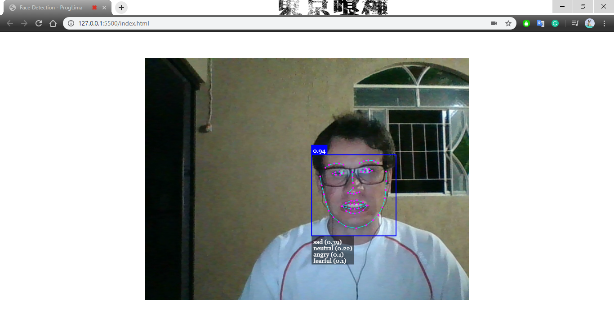
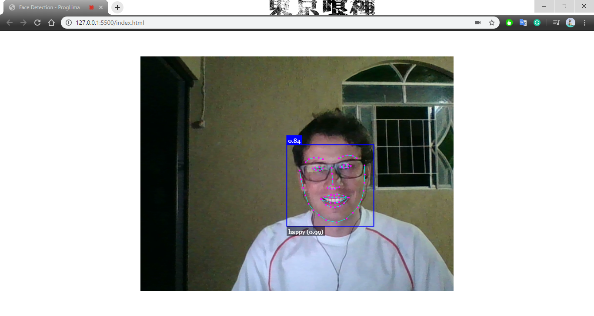
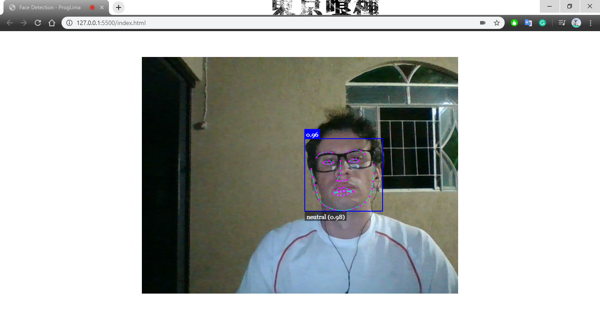
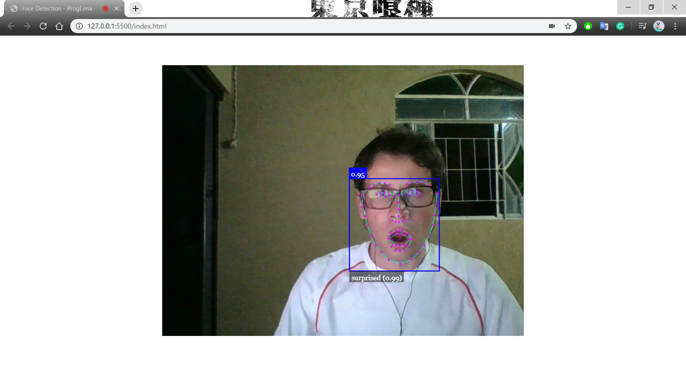

# Face-Detection-JS

## About This Project
In this project, face detection was set up in real time through a webcam using AI.

This AI is so fast that it is able to draw in real time the various faces and expressions of everyone on the camera without much performance overhead.

JS library of the Face API, built on Tensor Flow, was used to configure face detection.

This design can be used with any webcam or mobile camera.

## Server
IDE Visual Studio Code is used and the option "Open with Live Server".

## Low-end Devices Bug's
The video eventListener for play fires up too early on low-end machines, before the video is fully loaded, which causes errors to pop up from the Face API and terminates the script (tested on Debian [Firefox] and Windows [Chrome, Firefox]). Replaced by playing event, which fires up when the media has enough data to start playing.

## Sad

## Happy

## Normal

## Surprise

